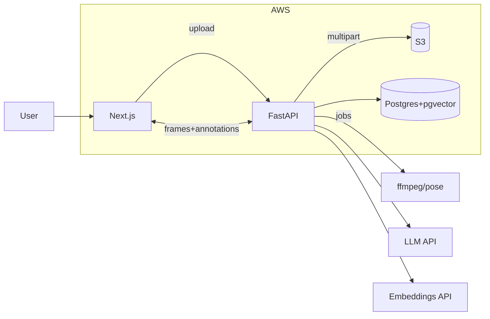

# GolfSwingCoachLLM# Golf Swing Coach MVP — Project Specification

This README is a specification and build contract to guide an AI coding agent and human reviewers. It defines the functional scope, directory layout, API contracts, data models, prompts, tests, CI/CD, and deployment targets.

## Goals

- Upload a golf swing video, extract or label key frames, annotate frames with basic markings, detect faults, retrieve drills from an internal knowledge base, and present a grounded practice plan generated by an LLM from retrieved drills only.
- Exercise LLM APIs, vector search, and RAG with a small, private knowledge base.
- Run locally via Docker Compose and deploy to AWS with Terraform, ECS Fargate, RDS Postgres, and S3. CI/CD via GitHub Actions.

## Non-Goals

- No public distribution of book contents. Drill cards must be original paraphrases with page citations where applicable.
- No advanced model training in this MVP. Frame selection and simple metrics are rule based.

---

## High Level Architecture

- **Frontend (Next.js)**: video upload, frame gallery, labeling UI, analysis and plan pages.
- **Backend (FastAPI)**: upload, processing jobs, annotations, metrics, fault detection, retrieval, plan generation.
- **Database (Postgres + pgvector)**: drills, embeddings, sessions, frames, annotations.
- **Object Storage (S3)**: raw videos and extracted frames.
- **LLM + Embeddings**: provider-agnostic clients through a narrow interface.
- **Infra**: Terraform modules for S3, RDS, ECS, ECR, ALB, IAM, SSM parameters.
- **CI/CD**: GitHub Actions builds, tests, pushes images to ECR, deploys to ECS.

Mermaid diagram (conceptual):



---

## Repository Structure

```
.
├── backend/                    # FastAPI app
│   ├── app/
│   │   ├── main.py
│   │   ├── api/                # routers
│   │   │   ├── upload.py
│   │   │   ├── frames.py
│   │   │   ├── annotations.py
│   │   │   ├── analyze.py      # pose, metrics, faults
│   │   │   ├── retrieve.py
│   │   │   └── plan.py
│   │   ├── core/               # config, logging, deps
│   │   ├── services/           # s3, embeddings, llm, reranker
│   │   ├── processing/         # ffmpeg, pose extraction
│   │   ├── models/             # SQLAlchemy models
│   │   ├── schemas/            # pydantic schemas
│   │   ├── analysis/           # rules for fault scoring
│   │   ├── prompts/            # system and task prompts
│   │   └── tests/              # pytest
│   ├── alembic/                # migrations
│   ├── Dockerfile
│   └── pyproject.toml
├── frontend/                   # Next.js app
│   ├── app/
│   │   ├── upload/page.tsx
│   │   ├── label/[videoId]/page.tsx
│   │   └── analyze/[videoId]/page.tsx
│   ├── components/
│   ├── e2e/                    # Cypress tests
│   ├── Dockerfile
│   └── package.json
├── data/
│   └── drills/                 # YAML drill cards
├── infra/                      # Terraform
│   ├── modules/
│   ├── envs/dev/
│   ├── envs/prod/
│   └── README.md
├── scripts/
│   ├── load_drills.py
│   ├── seed_local.py
│   └── print_config.py
├── .github/workflows/ci-cd.yml
├── docker-compose.yml
├── Makefile
└── README.md  # this file
```

---

## Functional Scope

### 1. Video Upload

- POST `/upload` accepts mp4 or mov up to 100 MB.
- Stores to S3 under `videos/{video_id}/raw.ext` using multipart upload.
- Returns `{ video_id, s3_key }`.
- Creates an async job to extract frames.

Validation:
- Reject unsupported MIME with 415.
- Reject size > 100 MB with 413.

### 2. Frame Extraction

- ffmpeg extracts N frames or uses model-driven key frames if available.
- Saves `videos/{video_id}/frames/frame_{i}.jpg` to S3.
- Stores rows in `frames(video_id, index, s3_key, width, height)`.

API:
- GET `/videos/{video_id}/frames` returns signed URLs and metadata.

### 3. Labeling and Annotations

- Frontend canvas tools: point, line, rectangle, angle.
- POST `/annotations` payload:
  ```
  {
    "video_id": "vid",
    "frame_id": "uuid",
    "annotations": [ { "type":"line", "p1":[x,y], "p2":[x,y] } ]
  }
  ```
- Annotations saved as JSON per frame. Re-fetch returns persisted data.

### 4. Pose and Metrics (optional but included)

- POST `/analyze/pose` -> per-frame keypoints and derived metrics:
  - spine_tilt_deg
  - pelvis_sway_cm
  - shaft_angle_deg at key frames
- Stored in `frame_metrics(frame_id, metrics jsonb)`.

### 5. Fault Detection

- POST `/analyze/faults` with `{ video_id }` returns:
  ```
  {
    "faults": [
      {"name":"early_extension","score":0.83},
      {"name":"over_the_top","score":0.62}
    ]
  }
  ```
- Rule based: thresholds on pose and annotation features.

### 6. Drill Knowledge Base

- Drill cards are original paraphrases in YAML. Example:

```yaml
id: "sts_hip_depth_wall"
title: "Maintain hip depth with wall feel"
faults: ["early_extension","loss_spine_angle"]
tags: ["pivot","hip_depth","at_home"]
steps:
  - "Trail hip 2 inches from wall at address."
  - "Backswing: maintain contact lightly."
  - "Downswing: lead hip replaces trail hip."
cues: ["hip back to wall","lead hip replaces trail hip"]
reps: "3 x 8 slow swings"
pitfalls: ["pelvis toward ball","standing up at impact"]
source: {book:"Stock Tour Swing", author:"Tyler Ferrell", pages:"112-114"}
```

- `scripts/load_drills.py` embeds `title + steps + cues + tags` and upserts to Postgres+pgvector.

### 7. Retrieval

- POST `/retrieve` input:
  ```
  { "faults":["early_extension"], "filters":{"environment":"range"}, "k":6 }
  ```
- Strategy:
  1. Filter by faults and tags.
  2. Vector search via pgvector cosine.
  3. Optional BM25 on titles.
  4. Rerank by tag overlap and fault match.

- Returns drills with debug scores and ordering.

### 8. LLM Plan Generation

- POST `/plan` input:
  ```
  { "faults":[...], "metrics":{...}, "drills":[...] }
  ```
- System prompt strictly enforces:
  - Use only provided drills.
  - Output valid JSON with schema:
    ```
    {
      explanation: str,
      time_minutes: int,
      drills: [{id,title,steps,reps,cues}],
      pitfalls: [str],
      citations: [{id, source}]
    }
    ```
- Pydantic validates. On schema failure, retry with the same inputs.
- Groundedness check rejects output containing phrases not present in provided drill fields.

---

## API Contracts

All responses use JSON. Important routes:

- `POST /upload` -> `{video_id, s3_key}`
- `GET /videos/{video_id}` -> `{status, counts, signed_urls?}`
- `GET /videos/{video_id}/frames` -> `{frames:[{frame_id, url, width, height}]}`
- `POST /annotations` -> `{ok:true}`
- `POST /analyze/pose` -> `{frames:[{frame_id, keypoints, metrics}]}` 
- `POST /analyze/faults` -> `{faults:[{name, score}]}` 
- `POST /retrieve` -> `{drills:[...], debug:{...}}`
- `POST /plan` -> structured JSON as above
- `GET /health` and `GET /ready` -> health checks
- `GET /metrics` -> Prometheus metrics

HTTP status codes:
- 200 success
- 202 accepted for async processing
- 400 bad request, 401 unauthorized, 413 payload too large, 415 unsupported media
- 422 validation failure, 500 server error

---

## Data Model

Postgres 16 with pgvector:

```sql
create extension if not exists vector;

create table drills (
  id text primary key,
  title text not null,
  body jsonb not null,          -- steps, cues, reps, pitfalls, source
  faults text[] not null,
  tags text[] default '{}',
  method text default 'neutral',
  level text default 'any',
  created_at timestamptz default now()
);

create table drill_embeddings (
  id text primary key references drills(id) on delete cascade,
  embedding vector(768) not null
);

create table videos (
  id uuid primary key,
  s3_key text not null,
  status text not null default 'uploaded',
  created_at timestamptz default now()
);

create table frames (
  id uuid primary key,
  video_id uuid references videos(id) on delete cascade,
  idx int not null,
  s3_key text not null,
  width int,
  height int,
  created_at timestamptz default now()
);

create table annotations (
  id uuid primary key,
  frame_id uuid references frames(id) on delete cascade,
  data jsonb not null,
  created_at timestamptz default now()
);

create table frame_metrics (
  frame_id uuid primary key references frames(id) on delete cascade,
  metrics jsonb not null,
  created_at timestamptz default now()
);

create table sessions (
  id uuid primary key,
  user_id uuid,
  video_id uuid references videos(id) on delete cascade,
  faults jsonb not null,
  created_at timestamptz default now()
);

create index on drills using gin (faults);
create index on drills using gin (tags);
create index on drill_embeddings using ivfflat (embedding vector_cosine) with (lists = 100);
```

---

## Configuration

Environment variables:

- Backend: `DB_URL`, `AWS_REGION`, `S3_BUCKET`, `EMBEDDINGS_API_KEY`, `LLM_API_KEY`, `USE_SSM`, `LOG_LEVEL`
- Frontend: `NEXT_PUBLIC_API_BASE`
- Terraform: `AWS_ACCOUNT_ID`, `AWS_REGION`, per env tfvars
- GitHub Actions: OIDC role to access AWS, ECR repository names

`print_config.py` prints a safe subset for debugging.

---

## Prompts

`prompts/system_plan.md`:

- You are a golf coaching assistant. Use only the provided drill snippets. Do not invent drills or cite external materials. Output valid JSON matching the schema. If information is missing, leave fields minimal and continue.

`prompts/task_plan.md`:

- Inputs: faults, metrics summary, drills[]. Produce:
  - One-paragraph explanation connected to the faults
  - Total time in minutes
  - 2 to 3 drills with steps and reps
  - 2 concise cues
  - 1 to 2 pitfalls
  - Citations array that lists drill ids and their source metadata

Validation rules:
- JSON only. No prose outside JSON.
- Titles and steps must be copied from provided drills.
- Reject if unfamiliar text appears.

---

## Testing Strategy

- **Unit tests**: upload validation, ffmpeg wrapper mocks, embeddings client, retrieval ranking, grounded JSON validator, rules engine for faults.
- **Integration tests**: end to end with docker-compose and seeded data.
- **Frontend e2e**: Cypress for upload, label, analyze, plan happy path.
- **Contract tests**: pydantic schemas for all API I/O.

Key acceptance checks:
- Upload->Frames available within flow using mocks.
- `/retrieve` returns drills where fault tag matches.
- `/plan` fails if the model outputs a drill id not provided.
- Groundedness guard prevents text not present in drills.

---

## Local Development

- `make compose-up` starts backend, frontend, Postgres, and any local S3 emulator if configured.
- `make seed` loads sample drills.
- Visit `http://localhost:3000`.

---

## CI/CD

GitHub Actions workflow:

- On PR:
  - Backend: ruff, mypy, pytest
  - Frontend: lint, type check, build
- On push to main:
  - Build Docker images
  - Push to ECR using OIDC
  - Run Alembic migrations on RDS
  - Update ECS service and wait for stable

Status checks required for merge:
- `backend-tests`, `frontend-tests`

---

## AWS Deployment

Terraform provisions:

- S3 buckets: `video-raw` and `video-frames` prefixes
- ECR repositories: backend and frontend
- RDS Postgres with security groups
- ECS Fargate services:
  - Backend behind ALB with health check `/ready`
  - Frontend as S3+CloudFront static site or ECS service
- IAM roles for ECS task execution and S3 access
- SSM Parameter Store for secrets

Outputs:
- ALB URL, RDS endpoint, bucket names, ECR repo URLs

---

## Security and Robustness

- CORS allowlist for frontend domain only
- Rate limit `/upload` and `/plan`
- Request timeouts and retries for LLM and embeddings
- Structured logs with request ids
- `/metrics` for Prometheus counters

---

## Sample Drill Cards

Include at least 25 cards in `data/drills/`. See `scripts/load_drills.py` for expected fields and embedding process.

---

## Roadmap After MVP

- Replace frame sampling with your trained key frame detector
- Add user profiles and preferences
- Add reranker model for retrieval
- Expand drill corpus and tag coverage
- A/B test prompt variants
